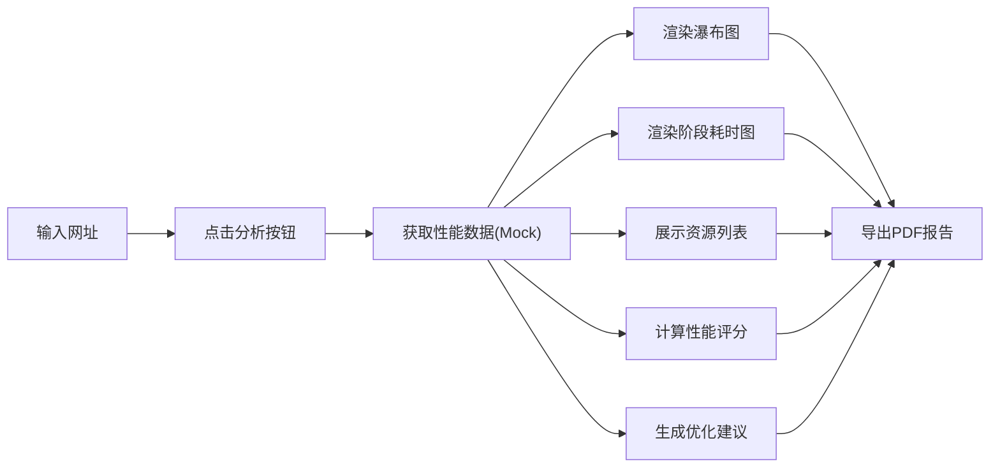

## 1. 产品概述

网页性能分析工具是一款基于 Vue 3 + TypeScript 的前端性能检测应用，通过 Performance API 和 Navigation Timing API 采集网页加载数据，帮助开发者分析和优化网站性能。

- **主要用途**：提供直观的性能数据可视化、资源加载分析、性能评分和优化建议
- **目标用户**：前端开发者、网站运维人员、性能优化工程师
- **产品价值**：帮助快速定位性能瓶颈，提供可操作的优化建议

## 2. 核心功能

### 2.1 用户角色
| 角色 | 注册方式 | 核心权限 |
|------|----------|----------|
| 普通用户 | 无需注册 | 使用所有性能分析功能，导出 PDF 报告 |

### 2.2 功能模块
1. **首页/分析页**：网址输入、性能分析结果展示
2. **性能概览**：加载时间瀑布图、阶段耗时条形图
3. **资源分析**：资源加载列表、按类型分类统计
4. **性能评分**：核心 Web Vitals 指标、仪表盘展示
5. **优化建议**：智能优化建议列表
6. **报告导出**：PDF 报告生成与下载

### 2.3 页面详情
| 页面名称 | 模块名称 | 功能描述 |
|----------|----------|----------|
| 分析首页 | 网址输入区 | 输入待分析网址，触发分析按钮 |
| 分析首页 | 加载瀑布图 | 可视化展示页面各阶段加载时间轴 |
| 分析首页 | 阶段耗时图 | DNS/TCP/SSL/TTFB/DOM/资源加载条形图 |
| 分析首页 | 资源列表 | 按类型分类的资源加载详情表格 |
| 分析首页 | 性能仪表盘 | FCP/LCP/CLS/FID/TBT 五维评分展示 |
| 分析首页 | 优化建议 | 针对性的性能优化建议列表 |
| 分析首页 | 导出功能 | 一键导出 PDF 分析报告 |

## 3. 核心流程

用户在输入框中输入待分析的网址，点击分析按钮后，系统使用 Mock 数据模拟 Lighthouse 分析结果，展示各项性能指标图表、资源加载详情、性能评分和优化建议，用户可选择导出 PDF 报告。

## 4. 用户界面设计

### 4.1 设计风格
- **主色调**：深蓝 #0F172A 作为主背景，科技蓝 #3B82F6 作为主色
- **辅助色**：成功绿 #10B981、警告黄 #F59E0B、危险红 #EF4444
- **按钮风格**：圆角 8px，悬停时轻微上浮效果
- **字体**：JetBrains Mono 用于数据展示，Inter 用于正文
- **布局风格**：卡片式布局，深色主题，科技感玻璃拟态效果
- **图标风格**：简洁线性图标，配合霓虹光效

### 4.2 页面设计概览
| 页面名称 | 模块名称 | UI 元素 |
|----------|----------|----------|
| 分析首页 | 网址输入区 | 深色输入框，蓝色发光按钮，玻璃拟态卡片 |
| 分析首页 | 瀑布图 | 时间轴横向布局，不同阶段用不同颜色区分 |
| 分析首页 | 阶段耗时图 | 横向条形图，渐变填充，数据标签 |
| 分析首页 | 资源列表 | 可排序表格，类型标签彩色标识 |
| 分析首页 | 仪表盘 | 环形进度条，五维雷达图，动画效果 |
| 分析首页 | 优化建议 | 可展开卡片，优先级标签，图标引导 |

### 4.3 响应式
- 桌面端优先设计，支持 1920px、1440px、1024px 断点
- 平板端自适应布局，图表区域单列展示
- 移动端简化展示，核心指标优先
- 触摸区域优化，确保按钮和可点击元素足够大

### 4.4 交互动效
- 页面加载：元素渐入 + 轻微上浮动画
- 数据更新：数字滚动动画，图表绘制动画
- 悬停效果：卡片发光边框，按钮背景渐变
- 状态切换：平滑过渡动画，进度条加载效果
