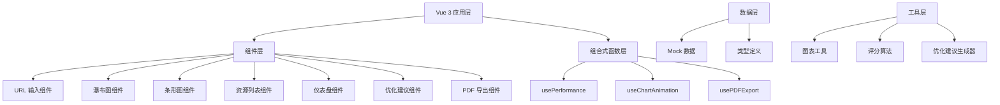

## 1. 架构设计



## 2. 技术描述

- **前端框架**：Vue 3 + TypeScript + Composition API
- **构建工具**：Vite 5.x
- **样式方案**：TailwindCSS 3.x
- **图表库**：ECharts 5.x（用于瀑布图、条形图、仪表盘、雷达图）
- **PDF 导出**：html2canvas + jspdf
- **图标库**：Lucide Icons
- **数据模拟**：自定义 Mock 数据模拟 Lighthouse 分析结果
- **性能 API**：Performance API + Navigation Timing API

## 3. 目录结构

```
src/
├── components/
│   ├── UrlInput.vue          # 网址输入组件
│   ├── WaterfallChart.vue    # 加载时间瀑布图
│   ├── TimelineBar.vue       # 阶段耗时条形图
│   ├── ResourceList.vue      # 资源加载列表
│   ├── ScoreGauge.vue        # 性能评分仪表盘
│   ├── SuggestionList.vue    # 优化建议列表
│   └── PDFExport.vue         # PDF 导出按钮
├── composables/
│   ├── usePerformance.ts     # 性能数据采集
│   ├── useChartAnimation.ts  # 图表动画
│   └── usePDFExport.ts       # PDF 导出功能
├── data/
│   └── mockData.ts           # Mock 性能数据
├── types/
│   └── performance.ts        # 类型定义
├── utils/
│   ├── scoreCalculator.ts    # 评分算法
│   └── suggestionEngine.ts   # 优化建议生成
├── App.vue                   # 主应用组件
└── main.ts                   # 入口文件
```

## 4. 类型定义

### 4.1 性能数据类型

```typescript
interface NavigationTiming {
  dnsLookup: number;
  tcpConnect: number;
  sslHandshake: number;
  ttfb: number;
  domParse: number;
  resourceLoad: number;
  domContentLoaded: number;
  loadEvent: number;
}

interface ResourceItem {
  id: string;
  url: string;
  name: string;
  type: 'image' | 'js' | 'css' | 'font' | 'xhr';
  size: number;
  duration: number;
  startTime: number;
  endTime: number;
  statusCode: number;
  initiatorType: string;
}

interface WebVitals {
  fcp: number;
  lcp: number;
  cls: number;
  fid: number;
  tbt: number;
}

interface PerformanceScore {
  overall: number;
  fcp: { value: number; score: number; label: string };
  lcp: { value: number; score: number; label: string };
  cls: { value: number; score: number; label: string };
  fid: { value: number; score: number; label: string };
  tbt: { value: number; score: number; label: string };
}

interface OptimizationSuggestion {
  id: string;
  title: string;
  description: string;
  priority: 'high' | 'medium' | 'low';
  category: 'images' | 'javascript' | 'css' | 'network' | 'rendering';
  impact: string;
  savings?: string;
}

interface PerformanceReport {
  url: string;
  timestamp: number;
  navigationTiming: NavigationTiming;
  resources: ResourceItem[];
  webVitals: WebVitals;
  score: PerformanceScore;
  suggestions: OptimizationSuggestion[];
}
```

## 5. 评分算法

### 5.1 Web Vitals 评分标准

| 指标 | 优秀 (90-100) | 良好 (50-89) | 较差 (0-49) |
|------|--------------|-------------|------------|
| FCP | ≤ 1.8s | ≤ 3.0s | > 3.0s |
| LCP | ≤ 2.5s | ≤ 4.0s | > 4.0s |
| CLS | ≤ 0.1 | ≤ 0.25 | > 0.25 |
| FID | ≤ 100ms | ≤ 300ms | > 300ms |
| TBT | ≤ 200ms | ≤ 600ms | > 600ms |

### 5.2 综合评分计算

```
综合得分 = (FCP×0.15) + (LCP×0.35) + (CLS×0.15) + (FID×0.15) + (TBT×0.20)
```

## 6. 核心功能实现

### 6.1 瀑布图组件
- 使用 ECharts 自定义系列实现
- X 轴为时间轴（毫秒）
- Y 轴为加载阶段/资源
- 不同类型资源用不同颜色标识
- 鼠标悬浮显示详细信息

### 6.2 性能仪表盘
- 环形进度条展示综合得分
- 雷达图展示五维指标分布
- 数字滚动动画效果
- 颜色根据分数动态变化（绿/黄/红）

### 6.3 PDF 导出
- 使用 html2canvas 捕获页面内容
- jspdf 生成 PDF 文档
- 支持 A4 纸张大小
- 包含所有分析图表和数据

## 7. 数据流向

```
输入 URL → 触发分析 → 生成 Mock 数据 
    → 计算性能评分 → 生成优化建议
        → 渲染所有图表组件 → 可选导出 PDF
```
